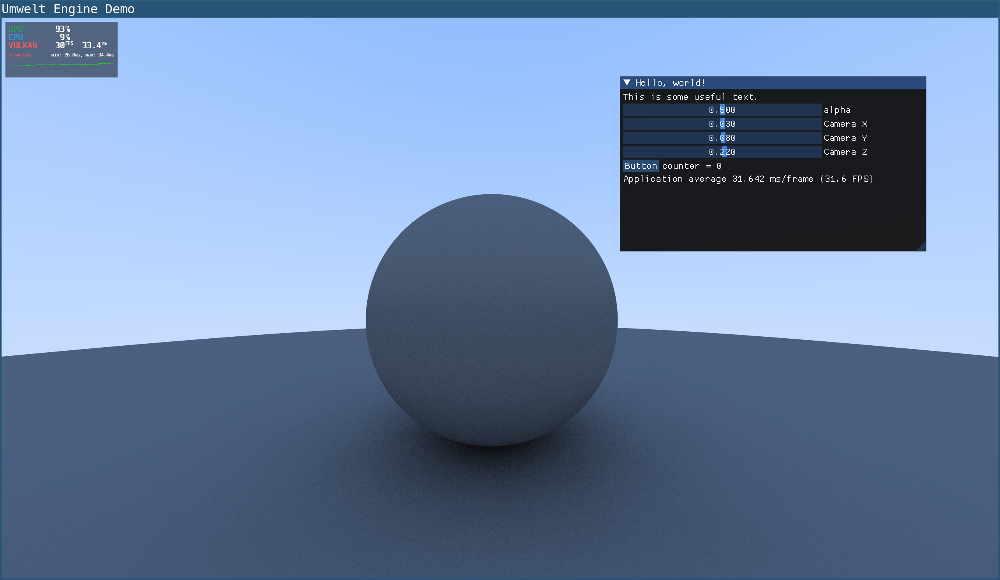
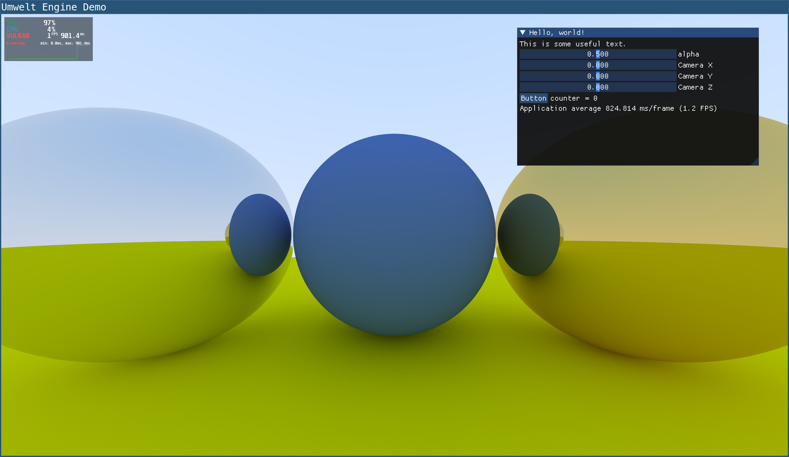
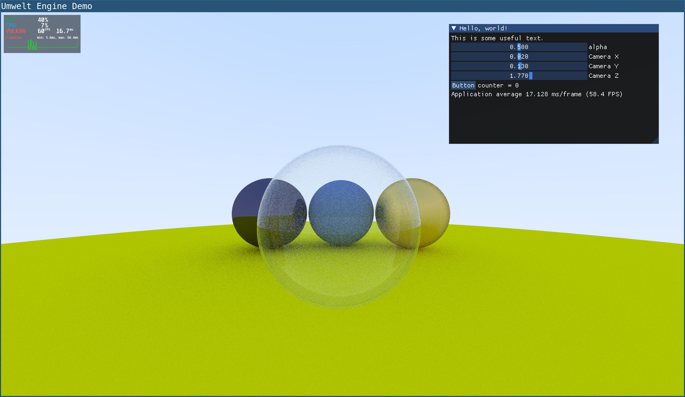
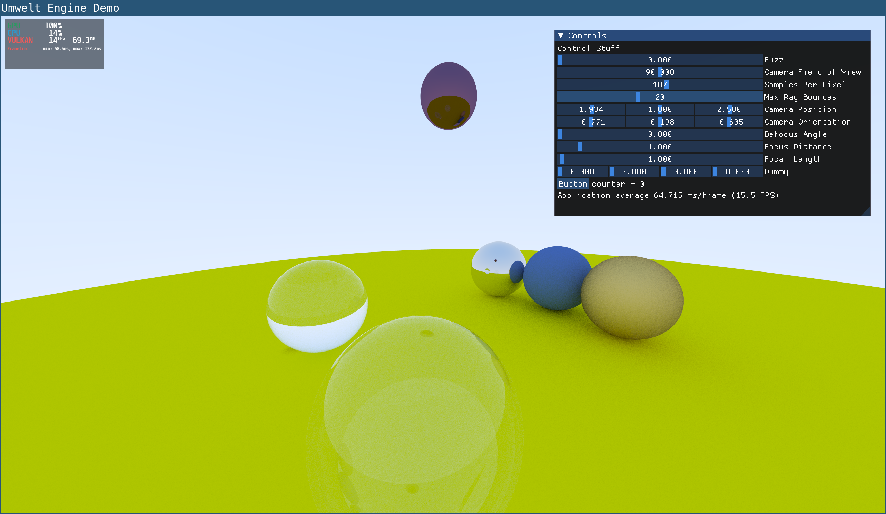
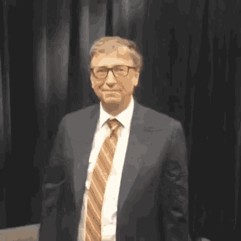

# Path Tracing with Vulkan

<!-- 

 -->



## Introduction

This project demonstrates a path tracing implementation based on [Ray Tracing in One Weekend](https://raytracing.github.io/books/RayTracingInOneWeekend.html) by Peter Shirley using Vulkan. It is designed to be a learning resource for understanding how to implement path tracing in a modern graphics API. It consists of two main components:

1. A compute shader that performs path tracing and outputs the result to a `VkImage`.
2. A graphics pipeline that fills the screen with two triangles and samples a texture, which is the `VkImage` produced by the compute shader.


The compute shader is written in Slang, a high-level shading language that compiles to SPIR-V. The graphics pipeline is implemented using Vulkan and GLFW for window management.

## Building

### Ubuntu/Debian

To build this project on Ubuntu or Debian, you need to have the following dependencies installed:

```bash
sudo apt install build-essential cmake vulkan-tools libvulkan-dev vulkan-utils vulkan-validationlayers-dev spirv-tools libglfw3-dev libglm-dev glslc
```

[Slang](https://shader-slang.org) is also required for shader compilation. You can install it by following the instructions on their [GitHub page](https://github.com/shader-slang/slang).

Then, you can build and run the project using the following command:

```bash
make run
```

### Windows

Fuck Windows.


## Controls

- **Mouse**: Look around.
- **WASD**: Move the camera.
- **Q/E**: Move the camera down/up.
- **Left Shift**: Move faster.
- **Left Ctrl**: Move slower.
- **Left Shift + Left Ctrl**: Move very slowly.
- **Space**: Toggle mouse cursor visibility.
- **Esc**: Exit the application.
- **R**: Reset the camera position.

## References

- [Ray Tracing in One Weekend Series](https://raytracing.github.io/)
- [Vulkan Programming Guide](https://a.co/d/duwHfyu)
- [Vulkan Tutorial](https://vulkan-tutorial.com/)
- [Vulkan Samples](https://github.com/SaschaWillems/Vulkan)
- [GLFW Documentation](https://www.glfw.org/docs/latest/)
- [Slang Documentation](https://shader-slang.github.io/)
- [Dear ImGui](https://github.com/ocornut/imgui)